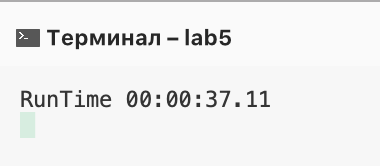
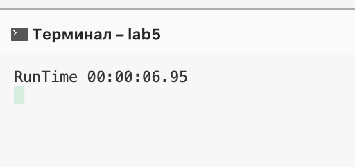

# Лаб 5 : Оптимизация

Foobar is a Python library for dealing with word pluralization.


## Условие задания

```c#
static void Main(string[] args)
{
    int[,,] a = new int[10,10,10];
    int res = 0;

    for (int i = 0; i < 10; i++)
    {
        for (int j = 0; j < 10; j++)
        {
            for (int k = 0; k < 10; k++)
            {
                a[k, j, i]++;
            }
        }
    }
}
```

Результат



## Оптимизация
```c#
            int[,,] a = new int[size, size, size];

            for (int i = 0; i < size; i++)
            {
                for (int j = 0; j < size; j++)
                {
                    for (int k = 0; k < size; k++)
                    {
                        a[i, j, k]++;
                    }
                }
            }
```

Результат

